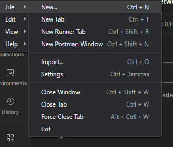
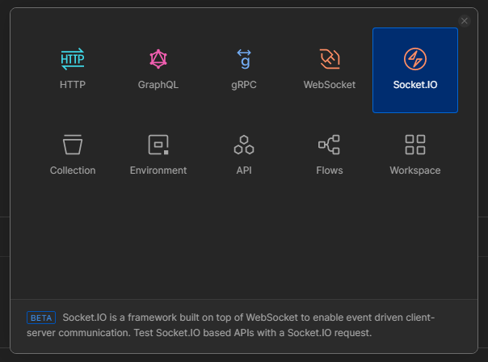
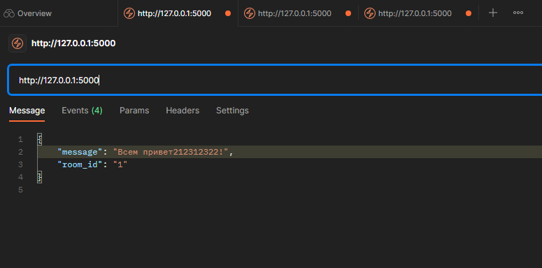
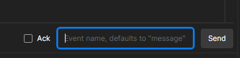
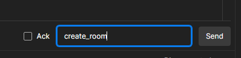
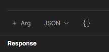
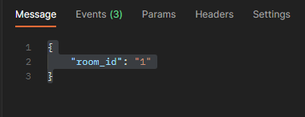
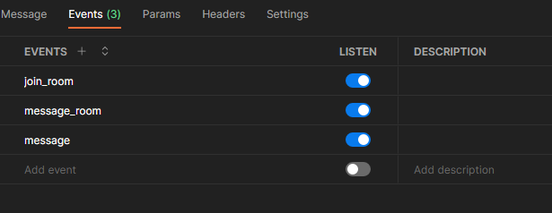
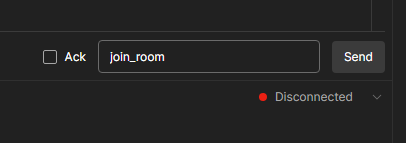
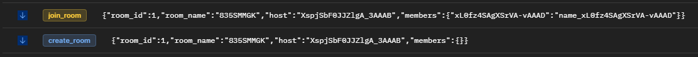

### Тестирование:
Для тестирования использую Postman.
Этапы:
##### Запускаем Postman, далее переходим в New...

##### Далее выбираем Socket.IO

---

##### Для примера моя рабочая область

---

##### В адресную строку пишем данные нашего сервера. Чтобы подключиться нажимаем кнопку "Connect". Далее создаем комнату с помощью события "create_room", пишем в поле ввода и отправляем.
 
Переходим на вторую вкладку (как в браузере), пишем в адресную строку адрес сервера. 
Выбираем формат сообщения JSON 

Первая комната создается с id = 1. Поэтому пишем сообщение

Переходим во вкладку "Events" и создаем чтение событий как на скрине

---

Чтобы подключиться к созданной комнате, пишем "join_room" в поле ввода события и отправляем. 

Возвращаемся в первую вкладку клиента и видим сообщения

---

Чтобы отправить сообщение, вводим имя события "message_room" и вводим в поле ввода сообщения своё сообщение {"message": "Привет!", "room_id": "1"}
Ключи "message", "room_id" обязательные.

